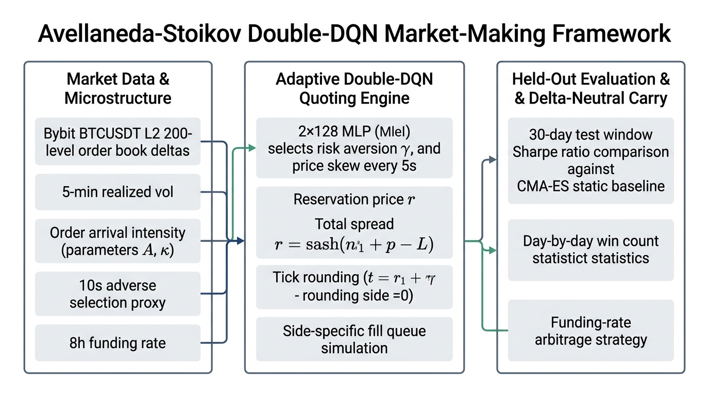

# Adaptive Avellaneda-Stoikov Market Making and Delta-Neutral Carry With Double DQN

High-frequency market making in cryptocurrency perpetual markets requires continuous balance between spread capture, inventory risk management, and order-flow adverse selection. Classical market-making models, such as the Avellaneda-Stoikov framework, derive optimal bid and ask quotes as a closed-form function of current inventory, time horizon, and a risk-aversion parameter. However, standard implementations keep risk-aversion fixed offline, ignoring intra-session market regime shifts in volatility, liquidity, and funding rates. This project implements an adaptive Avellaneda-Stoikov market-making system for Bybit BTCUSDT linear perpetual futures, where a Double Deep Q-Network (Double DQN) dynamically adjusts both risk-aversion and price skew parameters every five seconds based on real-time market microstructure signals.

The system ingests Bybit's public historical L2 order-book snapshots, incremental depth deltas, trade prints, and 8-hour funding settlement rates. A reusable order-book replay engine reconstructs full 200-level depth states at sub-second resolution, while trailing 24-hour log-linear regressions continuously estimate order-arrival intensity parameters. Every five seconds, the Double DQN agent observes a six-dimensional state vector—comprising normalized inventory, trailing five-minute realized volatility, arrival intensity, time remaining in a rolling hourly horizon, a trailing 10-second post-trade price-impact adverse-selection proxy, and normalized funding rate—and selects a joint risk-aversion and price-skew action. Quotes are generated via the reservation price equation, rounded to the $0.10 tick size with an enforced minimum-spread floor, and simulated using side-specific queue matching against real historical trade execution prints.

To isolate the genuine value of reinforcement learning adaptivity, the system evaluates the adaptive policy against a population-based CMA-ES static baseline that optimizes fixed risk-aversion and skew parameters jointly over the training split. Out-of-sample performance is measured on a held-out 30-day evaluation split using reference-capital-normalized daily Sharpe ratio, Sortino ratio, per-day win count statistics, and 24 UTC hour-of-day P&L attribution. Additionally, the system incorporates a standalone, delta-neutral funding-rate arbitrage strategy operating on spot and perpetual markets, harvesting 8-hour carry income independently of the market-making inventory.

Execution runbooks, testing procedures, and Vast.ai GPU training commands are detailed in `runbook.md`.
